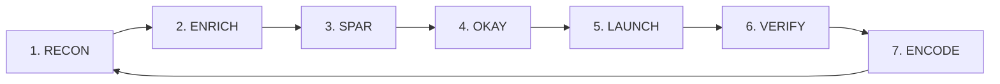

# SPARKIT-Agentic Architecture Specification

**Version**: 1.0  
**Date**: January 2026  
**Status**: Draft

---

## 1. Executive Summary

This document specifies the **SPARKIT-Agentic** architecture — the evolution of SPARKIT from a deliberation protocol into a full decision-and-execution engine.

**Core Thesis**: SPARKIT provides the *deliberation kernel*. DMG provides the *persistence and learning layer*. Together, they form a complete agentic reasoning system.

```
┌─────────────────────────────────────────────────────────────┐
│                    SPARKIT-Agentic Loop                     │
│                                                             │
│   ┌─────────┐    ┌─────────┐    ┌─────────┐    ┌─────────┐ │
│   │ SPAR    │───▶│ Action  │───▶│ Observe │───▶│ Update  │ │
│   │ Deliber │    │ Execute │    │ Reality │    │ DMG     │ │
│   └────┬────┘    └─────────┘    └─────────┘    └────┬────┘ │
│        │                                            │      │
│        └──────────────◀────────────────────────────┘      │
│                    Memory Enrichment                       │
└─────────────────────────────────────────────────────────────┘
```

---

## 2. Conceptual Foundation

### 2.1 What SPARKIT Provides (Deliberation)

| Capability | SPARKIT Component | Status |
|------------|-------------------|--------|
| Multi-perspective planning | NEWS Compass (N/E/S/W agents) | ✅ Complete |
| Structured disagreement | Clash + Probe phases | ✅ Complete |
| Option generation | TESSERACT configurations | ✅ Complete |
| Synthesis | Arbiter agent | ✅ Complete |

### 2.2 What DMG Provides (Persistence + Learning)

| Capability | DMG Primitive | MERIT Principle |
|------------|---------------|-----------------|
| Outcome tracking | OUTCOME | **M**easured |
| Evidence documentation | MEMO + TRACE | **E**videnced |
| Rollback capability | DOORS | **R**eversible |
| Audit trail | MOMENT | **I**nspectable |
| Provenance chain | TRACE | **T**raceable |

### 2.3 The Missing Piece: Closed Loop

SPARKIT alone is **open-loop** — it reasons but doesn't learn from outcomes.

SPARKIT + DMG is **closed-loop** — decisions are tracked, outcomes measured, and future deliberations enriched.

---

## 3. Agentic Loop Specification

### 3.1 The RESOLVE Loop

The agentic loop follows the **RESOLVE** protocol — a 7-phase cycle that turns uncertainty into action:

> **R**econ → **E**nrich → **S**PAR → **O**kay → **L**aunch → **V**erify → **E**ncode



| Phase | Letter | Input | Process | Output |
|-------|--------|-------|---------|--------|
| **1. RECON** | R | User question + context | Define decision boundaries | Scoped question |
| **2. ENRICH** | E | Scoped question + Memory Store | Retrieve relevant prior decisions | Enriched context |
| **3. SPAR** | S | Enriched context | SPARKIT deliberation (NEWS + Synthesis) | SPAR output |
| **4. OKAY** | O | SPAR output | Governance gate check | Go/No-Go/Escalate |
| **5. LAUNCH** | L | Validated decision | Action dispatch | Action result |
| **6. VERIFY** | V | Action result | Reality measurement | Observation data |
| **7. ENCODE** | E | Observation data | DMG OUTCOME write | Updated DMG |

**Why RESOLVE?**
- Action-oriented verb
- Captures purpose: turning uncertainty into resolution
- Each phase name is natural and descriptive
- Memorable mnemonic for practitioners

### 3.2 Phase Details

#### Phase 2: ENRICH (Memory Retrieval)

```python
def enrich_context(question: str, memory_store: MemoryStore) -> str:
    """Retrieve relevant prior decisions for context enrichment."""
    
    # Query similar decisions
    similar = memory_store.query(
        question=question,
        limit=5,
        min_merit_score=3  # Only MERIT-Partial or better
    )
    
    # Extract lessons learned
    lessons = []
    for dmg in similar:
        for check in dmg.outcome.checks:
            if check.assumptions_audit:
                lessons.extend([
                    a.learning for a in check.assumptions_audit 
                    if not a.accurate
                ])
    
    return f"{original_context}\n\nPrior lessons: {lessons}"
```

#### Phase 4: VALIDATE (Governance Gates)

```python
def check_governance(dmg: DMG, proposed_action: Action) -> GateResult:
    """Validate action against RAMP-based governance gates."""
    
    ramp_level = dmg.memo.ramp.level
    
    # Gate 1: RAMP-based auto-approve threshold
    if ramp_level <= 2 and proposed_action.is_reversible:
        return GateResult.APPROVED
    
    # Gate 2: Dissent resolution requirement
    unresolved = [d for d in dmg.objects.dissents if not d.resolution]
    if ramp_level >= 4 and unresolved:
        return GateResult.ESCALATE_HUMAN
    
    # Gate 3: DOORS completeness check
    if ramp_level >= 3:
        if not dmg.objects.doors.own.name:
            return GateResult.BLOCKED("DOORS owner required for RAMP 3+")
        if not dmg.objects.doors.signals:
            return GateResult.BLOCKED("DOORS signals required for RAMP 3+")
    
    return GateResult.APPROVED
```

#### Phase 7: UPDATE (Outcome Recording)

```python
def record_outcome(dmg: DMG, observation: Observation) -> DMG:
    """Close the loop by recording actual outcome."""
    
    check = OutcomeCheck(
        check_date=datetime.now(),
        actual_result=observation.summary,
        
        # Audit predictions
        expected_outcomes_audit=[
            ExpectedOutcomeAudit(
                metric=exp.metric,
                predicted=exp.expected,
                confidence=exp.confidence,
                actual=observation.get_metric(exp.metric),
                delta=calculate_delta(exp.expected, observation.get_metric(exp.metric))
            )
            for exp in dmg.memo.expected_outcomes
        ],
        
        # Audit dissents
        dissent_audit=[
            DissentAudit(
                dissent_id=d.dissent_id,
                vindicated=observation.validates(d.claim),
                note=f"Observation: {observation.summary}"
            )
            for d in dmg.objects.dissents
        ],
        
        verdict=determine_verdict(dmg, observation),
        next_action=suggest_next_action(dmg, observation)
    )
    
    dmg.objects.outcome.checks.append(check)
    return dmg
```

---

## 4. Governance Model

### 4.1 RAMP-Based Action Control

| RAMP Level | Auto-Execute | Human Confirm | Full Escalation |
|------------|--------------|---------------|-----------------|
| 1 (Minutes) | ✅ | - | - |
| 2 (Hours-Days) | ✅* | If irreversible | - |
| 3 (Weeks) | - | ✅ | If unresolved dissent |
| 4 (Months) | - | ✅ | If confidence < 0.6 |
| 5 (Years/Never) | - | - | ✅ Always |

*Requires DOORS.ready to be populated

### 4.2 Escalation Triggers

```python
ESCALATION_RULES = {
    "unresolved_dissent": lambda dmg: any(d for d in dmg.objects.dissents if not d.resolution),
    "low_confidence": lambda dmg: dmg.memo.expected_outcomes[0].confidence < 0.6,
    "missing_doors_owner": lambda dmg: not dmg.objects.doors.own.name,
    "high_tension_count": lambda dmg: len(dmg.synthesis.key_tensions) > 3,
    "no_reversal_conditions": lambda dmg: not dmg.objects.commit.conditions_to_stay_committed
}
```

---

## 5. Memory Architecture

### 5.1 Decision Memory Store

Each completed DMG is stored with:
- **Question embedding** (for semantic search)
- **MERIT score** (for quality filtering)
- **Outcome history** (for learning retrieval)
- **Domain tags** (for scoped queries)

### 5.2 Retrieval Strategy

```python
class DecisionMemory:
    def query(self, question: str, domain: str = None, limit: int = 5) -> List[DMG]:
        """Retrieve relevant prior decisions."""
        
        candidates = self.semantic_search(question, limit * 3)
        
        # Filter by quality
        candidates = [d for d in candidates if d.merit_score >= 3]
        
        # Prioritize completed outcomes
        candidates.sort(key=lambda d: (
            len(d.outcome.checks),  # More outcome data = more valuable
            d.merit_score,          # Higher MERIT = more reliable
            -d.age_days             # More recent = more relevant
        ), reverse=True)
        
        return candidates[:limit]
```

---

## 6. Integration Points

### 6.1 SPARKIT → DMG Adapter (Existing)

The current `SPARAdapter` handles SPAR → DMG conversion.

### 6.2 AgenticSPARAdapter (New)

Extends base adapter with:
- `enrich_context()` — Memory retrieval
- `check_governance()` — Gate validation
- `record_outcome()` — Loop closure
- `run_loop()` — Full agentic cycle

### 6.3 Action Dispatcher Interface

```python
class ActionDispatcher(Protocol):
    """Interface for action execution backends."""
    
    def can_execute(self, action: Action) -> bool:
        """Check if dispatcher handles this action type."""
    
    def execute(self, action: Action) -> Observation:
        """Execute action and return observation."""
    
    def rollback(self, action: Action) -> bool:
        """Attempt to reverse action."""
```

---

## 7. Comparison: SPARKIT vs Full Agentic

| Capability | SPARKIT Alone | SPARKIT-Agentic |
|------------|---------------|-----------------|
| Planning | ✅ Strong | ✅ Strong |
| Tool use | ❌ External | ✅ Integrated |
| Execution | ❌ Not required | ✅ Action dispatch |
| Verification | ⚠️ Argument-based | ✅ Observation-based |
| Memory | ⚠️ Usually absent | ✅ Decision memory |
| Learning | ❌ Not inherent | ✅ Outcome feedback |
| Governance | ⚠️ Can be argued | ✅ RAMP-enforced |

---

## 8. Implementation Roadmap

### Phase 1: Foundation (Current)
- [x] SPARKIT deliberation engine
- [x] DMG persistence format
- [x] SPAR → DMG adapter

### Phase 2: Closed Loop (This Spec)
- [ ] Memory retrieval integration
- [ ] Governance gate implementation
- [ ] Outcome recording API
- [ ] AgenticSPARAdapter

### Phase 3: Action Dispatch (Future)
- [ ] Action dispatcher interface
- [ ] Tool integration (search, execute, verify)
- [ ] Rollback automation

### Phase 4: Multi-Agent (Future)
- [ ] Shared memory between SPAR runs
- [ ] Cross-decision coordination
- [ ] Federated governance

---

*End of SPARKIT-Agentic Architecture Specification v1.0*
