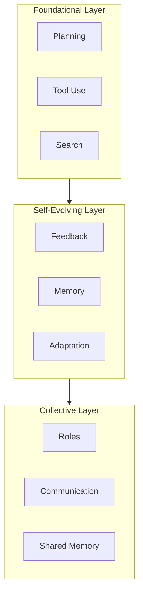
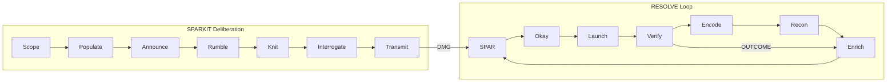
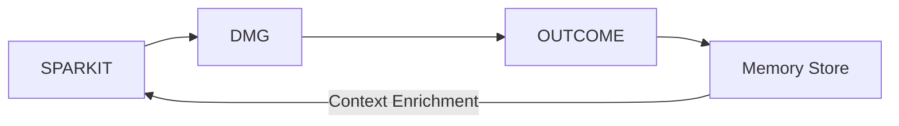
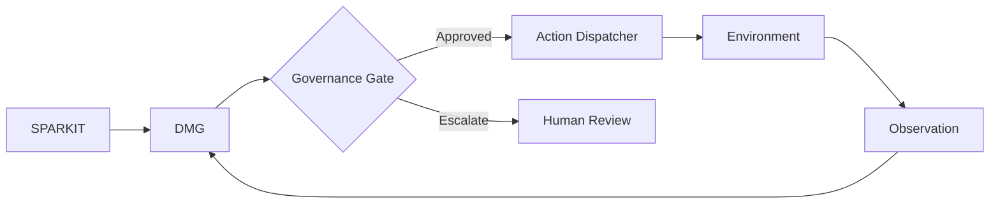

# SPARKIT vs Agentic Reasoning: Taxonomy Comparison

**Version**: 1.0  
**Date**: January 2026

---

## Overview

This document provides an explicit mapping between **SPARKIT** (Structured Persona-Argumentation Kit) and the **Agentic Reasoning** taxonomy from the [2025 survey](https://arxiv.org/abs/2601.12538) on LLMs as autonomous agents.

**Key Insight**: SPARKIT is a subset of agentic reasoning, it's a strong collective deliberation pattern that improves planning and reduces single-thread errors. Agentic reasoning is SPARKIT + action + feedback + memory + learning in dynamic environments.

---

## 1. Conceptual Core Comparison

| Dimension | SPARKIT | Agentic Reasoning |
|-----------|---------|-------------------|
| **Primary Output** | Decision + rationale | Policy/behavior that succeeds over time |
| **Optimization Target** | Reduce isolated reasoning errors | Succeed in open-world, evolving tasks |
| **Failure Mode** | "Convincing but wrong synthesis" | "Acts confidently, breaks reality/safety" |
| **Unit of Progress** | Better argumentation + synthesis | Better interaction loop (plan→act→observe→update) |
| **Scope** | Single deliberation session | Continuous learning across sessions |

### Key Difference

**SPARKIT can be "correct" without acting.** The synthesis may be brilliant, but if it never touches reality, it remains theoretical.

**Agentic systems are judged by outcomes under interaction.** A mediocre plan executed with feedback loops beats a perfect plan never tested.

---

## 2. Three-Layer Mapping

The survey organizes agentic reasoning into three layers:



### SPARKIT's Position

| Layer | Survey Components | SPARKIT Coverage | Gap Analysis |
|-------|-------------------|------------------|--------------|
| **Foundational** | Planning, Tool Use, Search | ✅ Strong planning via NEWS + TESSERACT | ❌ No native tool use; ❌ No search integration |
| **Self-Evolving** | Feedback, Memory, Adaptation | ⚠️ Can receive feedback (new round) | ❌ No persistent memory; ❌ No automatic adaptation |
| **Collective** | Roles, Communication, Shared Memory | ✅ Strong role system (N/E/S/W + personas) | ⚠️ No cross-session shared memory |

### Verdict

**SPARKIT lives primarily in the Foundational layer** with strong contributions to the Collective layer. It lacks the Self-Evolving layer entirely, this is where DMG integration becomes critical.

---

## 3. Component-by-Component Matrix

| Capability | SPARKIT (Out of Box) | Agentic Reasoning (Per Survey) | DMG-Enabled Solution |
|------------|---------------------|-------------------------------|---------------------|
| **Planning** | ✅ Strong (options + tensions identified) | ✅ Core primitive | — |
| **Tool Use / Search** | ❌ Optional / external | ✅ Core primitive | *Future: Action Dispatcher* |
| **Execution** | ❌ Not required | ✅ Required (actions in environment) | *Future: Action Dispatcher* |
| **Verification** | ⚠️ Argument-based (rebuttals) | ✅ Action/observation-based (grounding) | ✅ **OUTCOME checks** |
| **Memory** | ⚠️ Usually absent | ✅ Central to self-evolving agents | ✅ **Decision Memory Store** |
| **Learning/Adaptation** | ❌ Not inherent | ✅ Self-evolving layer | ✅ **Outcome → Enrichment loop** |
| **Multi-agent Coordination** | ✅ NEWS compass + roles | ✅ Protocols, roles, shared memory | ⚠️ Partial (cross-session TODO) |
| **Governance/Safety** | ⚠️ Can be argued in synthesis | ✅ Must be engineered + evaluated | ✅ **RAMP + Governance Gates** |

---

## 4. Two Optimization Modes

The survey distinguishes:

| Mode | Description | SPARKIT Position |
|------|-------------|-----------------|
| **In-Context Reasoning** | Orchestration at inference time, no parameter updates | ✅ **SPARKIT is naturally in-context** |
| **Post-Training Reasoning** | Internalized strategies via RL / fine-tuning | ❌ Not applicable |

### Implications

SPARKIT operates as an **in-context optimizer** — it's a promptable protocol that shapes reasoning during a single session. To become agentic in the survey's sense, SPARKIT needs either:

1. **In-context agent wrapper**: SPARKIT → tool calls → env feedback → SPARKIT revises
2. **Post-training internalization**: Train a model to do SPARKIT-like dialectic + action selection automatically

The **AgenticSPARAdapter** implements option 1.

---

## 5. The Bridge: SPARKIT as Deliberation Module

The minimal agent loop follows the **RESOLVE** protocol:

```
RECON → ENRICH → SPAR → OKAY → LAUNCH → VERIFY → ENCODE → (repeat)
```

SPARKIT fits as the **deliberation engine** at Phase 3 (SPAR):



| RESOLVE Phase | SPARKIT Role | DMG Primitive |
|---------------|--------------|---------------|
| **RECON** | Define question boundaries | MEMO.title |
| **ENRICH** | Retrieve prior lessons | Memory Store |
| **SPAR** | Full deliberation (NEWS + Synthesis) | MEMO.options |
| **OKAY** | Governance gate validation | RAMP + DOORS |
| **LAUNCH** | (External) Execute action | — |
| **VERIFY** | Observe reality | OUTCOME.checks |
| **ENCODE** | Write outcome to graph | MOMENT event |

---

## 6. Gap Analysis: What SPARKIT Misses

### Critical Gaps

| Gap | Survey Requirement | Current State | Solution |
|-----|-------------------|---------------|----------|
| **Environment Grounding** | Verifier tests claims against reality | Rhetorical critique only | ✅ OUTCOME checks |
| **Persistent Memory** | Decisions inform future reasoning | Stateless per session | ✅ Decision Memory Store |
| **Long-Horizon Evaluation** | Track decision quality over weeks/months | No outcome tracking | ✅ OUTCOME.next_check_date |
| **Governance Gates** | Safety checks before action | Argued in synthesis | ✅ RAMP-based gates |
| **Action Dispatch** | Execute decisions in environment | Not supported | 🔜 Action Dispatcher (future) |

### MERIT Alignment

The survey's requirements map directly to MERIT principles:

| Survey Requirement | MERIT Principle | DMG Primitive |
|-------------------|-----------------|---------------|
| Measurable outcomes | **M**easured | OUTCOME |
| Documented reasoning | **E**videnced | MEMO + TRACE |
| Reversible actions | **R**eversible | DOORS |
| Auditable decisions | **I**nspectable | MOMENT |
| Provenance chain | **T**raceable | TRACE |

---

## 7. Upgrade Path: SPARKIT → SPARKIT-Agentic

### Phase 1: Closed Loop (Current)



- ✅ SPARAdapter converts deliberation to DMG
- ✅ AgenticSPARAdapter adds feedback loop
- ✅ Governance gates enforce RAMP-based control
- ✅ Memory enriches future deliberations

### Phase 2: Action Dispatch (Future)



- 🔜 Action Dispatcher interface
- 🔜 Tool integration (search, execute, verify)
- 🔜 Automatic rollback from DOORS

### Phase 3: Multi-Agent Coordination (Future)

- 🔜 Shared memory between SPAR runs
- 🔜 Cross-decision coordination
- 🔜 Federated governance across agents

---

## 8. Summary

| Aspect | SPARKIT Alone | SPARKIT-Agentic (with DMG) |
|--------|---------------|---------------------------|
| **Paradigm** | Deliberation protocol | Decision-and-execution engine |
| **Scope** | Single session | Cross-session learning |
| **Grounding** | Argument-based | Reality-grounded |
| **Memory** | Stateless | Persistent decision memory |
| **Governance** | Recommended | Enforced |
| **Survey Layer Coverage** | Foundational + Collective | All three layers |

### The Thesis

> **SPARKIT supplies the thought architecture. Agentic reasoning supplies the interaction + learning architecture. DMG bridges them.**

The future isn't better reasoning traces, it's closed learning loops.

```
Reason → Act → Observe → Update → Coordinate → Govern
```

---

*End of SPARKIT vs Agentic Reasoning Comparison v1.0*


---

## RAPS REVIEW

| Field | Value |
|-------|-------|
| Review Tier | Lite |
| Review Due | TBD (needs confidence score) |
| Review Status | Pending |
| Verdict Status | Unknown |
| Evidence | - |
| Corrective Action | - |
| Reviewed By | - |
| Review Date | - |
